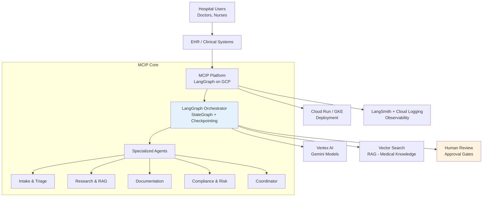

# High-Level Solution Architecture Document (HLD)

**Project Name:** Multi-Agent Clinical Intelligence Platform (MCIP)  
**Version:** 1.0  
**Date:** July 06, 2026  
**Author:** Grok (Solution Architect)  
**Status:** Draft for Stakeholder Review

---

## 1. Executive Summary

The **MCIP** is a stateful multi-agent AI platform built with **LangGraph** on **Google Cloud Platform (GCP)**. It coordinates specialized agents to assist clinicians with documentation, evidence-based research, and workflow support while maintaining strong human oversight and compliance.

**Core Objective**: Reduce administrative burden on doctors, improve documentation quality, and support better clinical decisions — all while keeping clinicians in full control.

**Key Benefits**:
- Significant reduction in documentation time
- Evidence-grounded outputs via RAG
- Full auditability and traceability
- Scalable and secure on GCP

---

## 2. Business & Clinical Context

### Primary Goals
- Assist with clinical note generation and discharge summaries
- Provide evidence-based research support
- Reduce clinician burnout from repetitive tasks
- Maintain highest standards of patient safety and regulatory compliance

### MVP Scope (Phase 1)
**Focus**: Clinical Documentation Assistance (General Medicine)  
**Key Features**:
- Patient case intake
- Literature & protocol-based research
- Draft clinical notes & summaries
- Human review and approval workflow

**Out of Scope (MVP)**: Direct diagnosis/treatment recommendations, imaging analysis, real-time triage.

---

## 3. High-Level Architecture

### Architecture Diagram

### Core Components
- **Orchestration**: LangGraph (StateGraph with checkpointing)
- **LLM**: Gemini models via Vertex AI
- **Knowledge Retrieval**: Vertex AI Vector Search (RAG)
- **Agent Layer**: Modular agents (Intake, Research, Documentation, Compliance, Coordinator)
- **State Management**: Persistent PatientCase state
- **Deployment**: Cloud Run / GKE + Vertex AI Agent Engine
- **Observability**: LangSmith + Google Cloud Operations

### High-Level Data Flow
Patient data → Intake Agent → Research Agent → Documentation Agent → Compliance Check → Human Review → Approved Output + Audit Log

---

## 4. Key Architecture Decisions

**ADR-001**: Use **LangGraph** as the primary orchestration framework.  
**Reason**: Best-in-class state management, durable execution, human-in-the-loop support, and production readiness required in healthcare.

**ADR-002**: Primary LLM = **Gemini via Vertex AI**.  
**Reason**: Native GCP integration, strong performance, multimodal support, and compliance features.

**ADR-003**: **Human-in-the-Loop by default** for all clinical outputs.  
**Reason**: Patient safety and regulatory requirements.

**ADR-004**: RAG-first approach with strict grounding.  
**Reason**: Minimize hallucinations and increase trustworthiness.

---

## 5. Non-Functional Requirements

- **Compliance**: HIPAA-aligned design with full audit trails
- **Security**: Data encryption, access control, VPC
- **Reliability**: Checkpointing, retries, error isolation
- **Observability**: End-to-end tracing and logging
- **Scalability**: Designed to support growing case volume
- **Performance**: Reasonable response times (<30s for most flows)

---

## 6. Phased Roadmap

- **Phase 1 (MVP)**: 8–10 weeks – Core documentation assistant
- **Phase 2**: Full multi-agent system + advanced capabilities
- **Phase 3**: Production hardening, integrations, pilot deployment
- **Phase 4**: Multimodal, adaptive learning, enterprise scale

---

## 7. Risks & Mitigation

**Major Risks**:
- Data quality and availability
- Clinician adoption
- Regulatory and compliance timelines
- AI accuracy expectations

**Mitigation**:
- Start with de-identified/synthetic data
- Weekly feedback loops with clinical champions
- Strong emphasis on human review

---

## 8. Next Steps

1. Stakeholder review and feedback on this HLD
2. Detailed Technical Design for MVP
3. Project repository setup and initial codebase
4. First development spike (LangGraph + Vertex AI integration)

**Approval Requested**:
- Overall architectural direction
- Technology stack
- MVP scope
